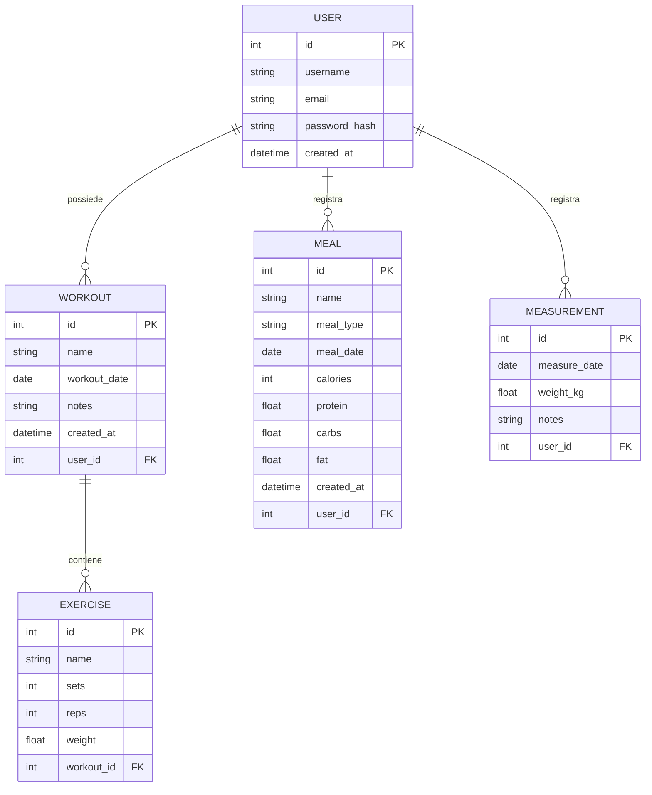

# Diagramma ER — FitLog

## Entità principali

**USER (utente)**

| Attributo | Tipo | Descrizione |
|-----------|------|-------------|
| id PK | INTEGER | Identificatore univoco |
| username | TEXT | Nome utente univoco |
| email | TEXT | Email univoca |
| password_hash | TEXT | Hash della password (mai in chiaro) |
| created_at | DATETIME | Data di creazione dell'account |

**WORKOUT (allenamento)**

| Attributo | Tipo | Descrizione |
|-----------|------|-------------|
| id PK | INTEGER | Identificatore univoco |
| name | TEXT | Nome dell'allenamento |
| workout_date | DATE | Data dell'allenamento |
| notes | TEXT | Note facoltative |
| created_at | DATETIME | Timestamp di creazione |
| user_id FK | INTEGER | Riferimento all'utente proprietario |

**EXERCISE (esercizio)**

| Attributo | Tipo | Descrizione |
|-----------|------|-------------|
| id PK | INTEGER | Identificatore univoco |
| name | TEXT | Nome dell'esercizio |
| sets | INTEGER | Numero di serie |
| reps | INTEGER | Ripetizioni per serie |
| weight | REAL | Peso utilizzato (kg) |
| workout_id FK | INTEGER | Riferimento all'allenamento |

**MEAL (pasto)**

| Attributo | Tipo | Descrizione |
|-----------|------|-------------|
| id PK | INTEGER | Identificatore univoco |
| name | TEXT | Nome del pasto o dell'alimento |
| meal_type | TEXT | Tipo: colazione, pranzo, cena, spuntino |
| meal_date | DATE | Data del pasto |
| calories | INTEGER | Calorie (kcal) |
| protein | REAL | Proteine (g) |
| carbs | REAL | Carboidrati (g) |
| fat | REAL | Grassi (g) |
| created_at | DATETIME | Timestamp di creazione |
| user_id FK | INTEGER | Riferimento all'utente proprietario |

**MEASUREMENT (misurazione del peso)**

| Attributo | Tipo | Descrizione |
|-----------|------|-------------|
| id PK | INTEGER | Identificatore univoco |
| measure_date | DATE | Data della misurazione |
| weight_kg | REAL | Peso corporeo (kg) |
| notes | TEXT | Note facoltative |
| user_id FK | INTEGER | Riferimento all'utente proprietario |

## Relazioni

- **USER — WORKOUT** (uno a molti): un utente possiede molti allenamenti tramite `user_id`.
- **WORKOUT — EXERCISE** (uno a molti): un allenamento contiene molti esercizi tramite `workout_id`.
- **USER — MEAL** (uno a molti): un utente registra molti pasti tramite `user_id`.
- **USER — MEASUREMENT** (uno a molti): un utente registra molte misurazioni tramite `user_id`.
- L'eliminazione di un utente o di un allenamento elimina automaticamente i dati collegati (`cascade delete`).
