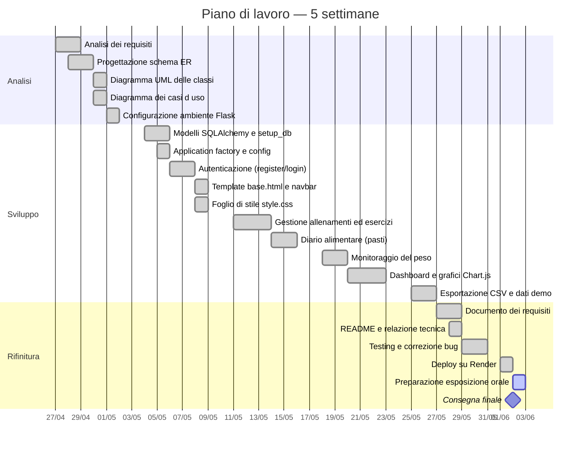

# Diagramma di Gantt — FitLog

## Riepilogo fasi

| Fase | Periodo | Durata |
|------|---------|--------|
| Analisi | 27/04 – 01/05/2026 | ~1 settimana |
| Sviluppo | 04/05 – 26/05/2026 | ~3 settimane |
| Rifinitura | 27/05 – 02/06/2026 | ~1 settimana |
