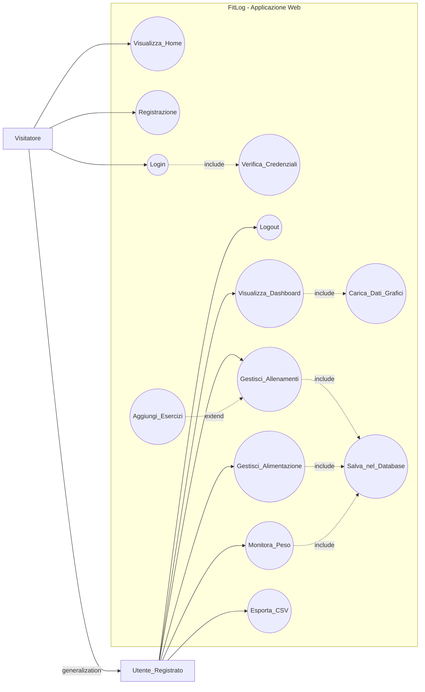
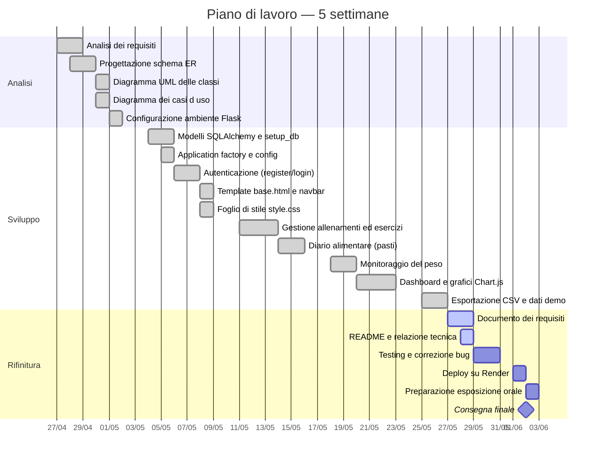
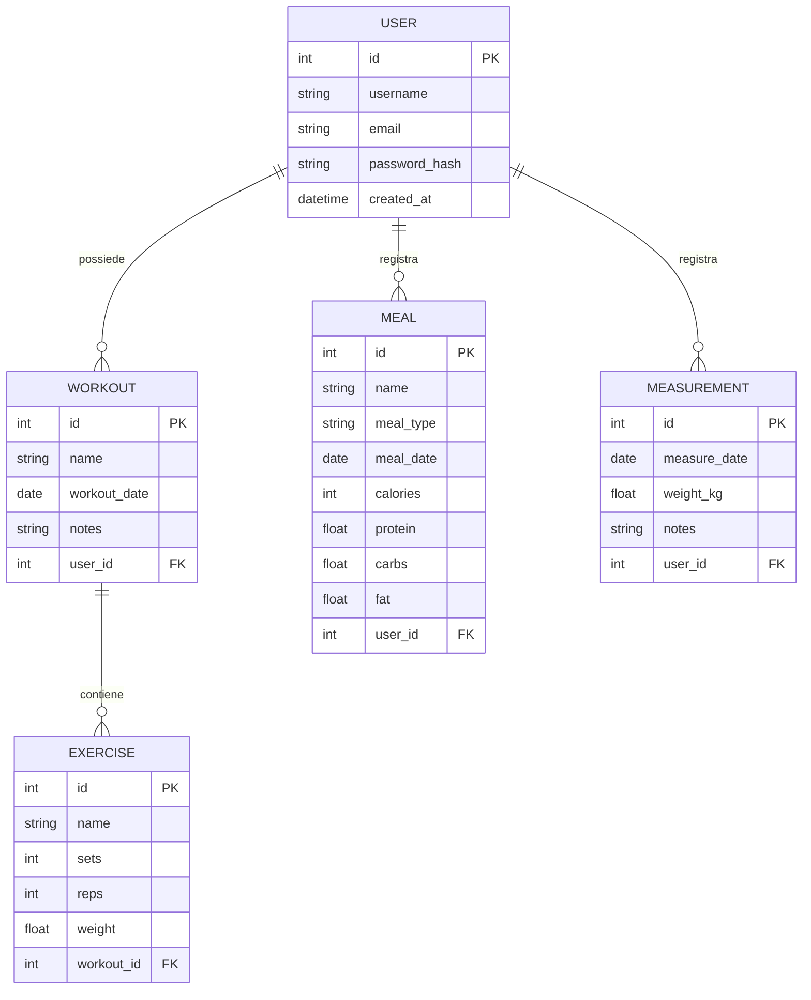
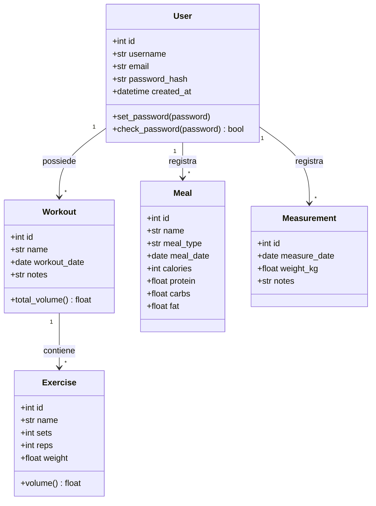

# Documento dei Requisiti — FitLog

**Progetto di fine anno · Modulo 03 — Sviluppo Web e Database**

| Campo | Valore |
|-------|--------|
| Studente | Francesco Cervesi |
| Classe | 5ªM · A.S. 2025/2026 |
| Materie | TPSIT · GPOI · Informatica · Sistemi e Reti |
| Data | 3 giugno 2026 |

---

## 1. Introduzione

### 1.1 Scopo del documento

Lo scopo di questo documento è:

- descrivere in modo chiaro il prodotto realizzato e le sue funzionalità principali;
- raccogliere i requisiti funzionali e non funzionali;
- fornire una prima progettazione concettuale con diagrammi ER, UML e casi d'uso, organizzata nelle fasi di analisi, sviluppo e rifinitura;
- definire una roadmap di lavoro con milestone e attività principali.

### 1.2 Contesto

Il progetto rientra nel percorso del quinto anno dell'indirizzo Informatica e Telecomunicazioni. Gli studenti devono realizzare un piccolo progetto web con backend in Python/Flask e database relazionale. Il tema scelto è il fitness, in particolare la gestione degli allenamenti e dell'alimentazione: un ambito reale in cui l'informatica supporta la salute e lo sport, come avviene in applicazioni diffuse del tipo MyFitnessPal, Strava o FatSecret.

Il progetto soddisfa i requisiti consigliati dalla traccia del modulo:

- gestione dati persistente tramite database relazionale (SQLite in sviluppo, PostgreSQL in produzione) attraverso l'ORM SQLAlchemy;
- interfaccia web con visualizzazione dinamica (grafici Chart.js alimentati con dati serializzati in JSON dal backend, tabelle generate dal database);
- backend in Python/Flask con routing, template Jinja2 e gestione delle sessioni utente;
- relazioni tra più tabelle nel database (utenti, allenamenti, esercizi, pasti, misurazioni).

### 1.3 Tema del progetto

**Tema scelto: FitLog — Applicazione per la gestione di allenamenti e alimentazione.**

Il progetto consiste in un'applicazione web che permette a ogni utente registrato di:

- creare allenamenti e aggiungere esercizi con serie, ripetizioni e peso, con calcolo automatico del volume di lavoro;
- registrare i pasti con calorie e macronutrienti (proteine, carboidrati, grassi), raggruppati per giorno con i relativi totali;
- registrare il proprio peso corporeo nel tempo e visualizzarne l'andamento;
- consultare una dashboard con grafici interattivi sui propri progressi;
- esportare i propri allenamenti in formato CSV;
- accedere a un'area personale protetta in cui i dati sono privati e visibili solo dopo il login.

L'applicazione legge e scrive i dati da un database relazionale con cinque tabelle correlate ed è pubblicata online sulla piattaforma cloud Render.

---

## 2. Obiettivi generali

- Realizzare un'applicazione web funzionante con Flask che gestisca dati persistenti in un database relazionale.
- Implementare un sistema di autenticazione sicuro con registrazione, login e password cifrate (hash).
- Progettare un database relazionale con cinque tabelle e le relative relazioni uno-a-molti.
- Permettere la gestione completa (creazione, lettura, eliminazione) di allenamenti, esercizi, pasti e misurazioni del peso.
- Visualizzare i progressi dell'utente attraverso grafici interattivi: andamento del peso, calorie giornaliere, frequenza degli allenamenti e ripartizione dei macronutrienti.
- Garantire che ogni utente acceda esclusivamente ai propri dati.
- Documentare in modo tecnico ogni componente del sistema, collegandolo alla materia di riferimento.
- Pubblicare l'applicazione online su una piattaforma cloud (Render) tramite un server di produzione (Gunicorn).
- Applicare il pattern architetturale MVC e organizzare il codice in modo manutenibile.

---

## 3. Stakeholder e attori

### 3.1 Stakeholder

| Stakeholder | Ruolo | Interesse |
|-------------|-------|-----------|
| Studente | Sviluppatore | Realizzare il progetto rispettando i requisiti tecnici e didattici |
| Docente | Valutatore | Verificare correttezza tecnica, completezza e collegamento alle materie |
| Utente finale | Persona che si allena | Tenere traccia di allenamenti, alimentazione e peso e visualizzare i propri progressi |

### 3.2 Attori principali

- **Visitatore** — accede al sito, visualizza la pagina di presentazione e può registrarsi ed effettuare il login. Senza autenticazione non accede alle aree personali.
- **Utente registrato** — attore specializzato del Visitatore (generalizzazione): può fare tutto ciò che fa il Visitatore e in più gestire i propri allenamenti, pasti e misurazioni e consultare la dashboard.

A differenza di un sistema con integrazioni esterne, FitLog non comunica con servizi di terze parti: tutti gli attori sono umani e ogni operazione avviene tra il browser dell'utente e il server Flask.

---

## 4. Requisiti funzionali

### 4.1 Requisiti principali

| ID | Requisito | Materia |
|----|-----------|---------|
| RF01 | Visualizzazione della home page pubblica di presentazione, accessibile senza login | Informatica |
| RF02 | Registrazione di un nuovo utente (username, email, password) con validazione dei dati | Informatica / TPSIT |
| RF03 | Login e logout con gestione della sessione tramite cookie firmati | TPSIT |
| RF04 | Hashing sicuro della password: mai salvata in chiaro nel database | Informatica / Sistemi e Reti |
| RF05 | Dashboard personale con statistiche di riepilogo (allenamenti totali, calorie del giorno, pasti registrati, ultimo peso) | Informatica / GPOI |
| RF06 | Quattro grafici interattivi Chart.js: peso (linea), macronutrienti del giorno (doughnut), allenamenti e calorie degli ultimi 7 giorni (barre) | GPOI / Informatica |
| RF07 | Gestione allenamenti: creazione, elenco, dettaglio ed eliminazione | Informatica |
| RF08 | Gestione degli esercizi all'interno di un allenamento (nome, serie, ripetizioni, peso) | Informatica |
| RF09 | Calcolo automatico del volume di lavoro (serie × ripetizioni × peso) per esercizio e per allenamento | Informatica |
| RF10 | Diario alimentare: registrazione dei pasti con calorie e macronutrienti, raggruppati per giorno con totali | Informatica |
| RF11 | Monitoraggio del peso corporeo nel tempo con grafico di andamento | Informatica / GPOI |
| RF12 | Esportazione degli allenamenti in formato CSV scaricabile | TPSIT |
| RF13 | Database relazionale con cinque tabelle correlate: utente, allenamento, esercizio, pasto, misurazione | Informatica |
| RF14 | Controllo degli accessi: ogni utente può visualizzare e modificare solo i propri dati | TPSIT / Sistemi e Reti |
| RF15 | Protezione delle pagine personali tramite login, con reindirizzamento se l'utente non è autenticato | TPSIT |
| RF16 | Navbar con evidenziazione della pagina attiva e footer comune a tutte le pagine | Informatica |
| RF17 | Pubblicazione online dell'applicazione su Render tramite il server WSGI Gunicorn | Sistemi e Reti |

### 4.2 User stories

- Come visitatore, voglio registrarmi ed effettuare il login, così da avere un'area personale in cui salvare i miei dati.
- Come utente, voglio creare un allenamento e aggiungere esercizi con serie, ripetizioni e peso, così da tenere uno storico delle mie sessioni.
- Come utente, voglio registrare i pasti con calorie e macronutrienti, così da monitorare la mia alimentazione giorno per giorno.
- Come utente, voglio registrare periodicamente il mio peso, così da vederne l'andamento nel tempo in un grafico.
- Come utente, voglio una dashboard con grafici di riepilogo, così da capire a colpo d'occhio i miei progressi.
- Come utente, voglio esportare i miei allenamenti in CSV, così da poterli analizzare anche con un foglio di calcolo.
- Come utente, voglio che i miei dati siano privati e accessibili solo dopo il login.

---

## 5. Requisiti non funzionali

| ID | Categoria | Descrizione |
|----|-----------|-------------|
| RNF01 | Usabilità | Interfaccia chiara e navigabile; la navbar indica sempre la pagina corrente |
| RNF02 | Prestazioni | Pagine caricate rapidamente in locale; grafici Chart.js fluidi e senza lag |
| RNF03 | Sicurezza | La SECRET_KEY non deve mai comparire nel codice sorgente: è salvata in un file `.env` escluso dal repository. Le password sono salvate solo come hash |
| RNF04 | Portabilità | Progetto eseguibile in locale (SQLite) e in produzione (PostgreSQL) senza modifiche al codice |
| RNF05 | Manutenibilità | Codice organizzato secondo il pattern MVC, con Application Factory, Blueprint e commenti esplicativi |
| RNF06 | Persistenza | I dati persistono tra una sessione e l'altra senza essere ricreati a ogni avvio |
| RNF07 | Responsività | Il sito è leggibile e utilizzabile sia da desktop sia da smartphone (layout responsive Bootstrap) |
| RNF08 | Coerenza visiva | Ogni pagina usa il template `base.html` con navbar, footer e foglio di stile condivisi |

---

## 6. Casi d'uso

### 6.1 Casi d'uso essenziali

- Visualizza home (presentazione)
- Registrazione utente
- Login utente
- Logout utente
- Visualizza dashboard con grafici
- Gestisci allenamenti (crea, elenca, apri, elimina)
- Aggiungi esercizi a un allenamento
- Gestisci alimentazione (registra ed elimina pasti)
- Monitora il peso corporeo
- Esporta allenamenti in CSV

### 6.2 Descrizione semplificata dei casi d'uso

| ID | Nome | Descrizione |
|----|------|-------------|
| UC1 | Visualizza home | Il visitatore apre il sito e vede la pagina di presentazione con le funzionalità principali. Se è già autenticato viene reindirizzato alla dashboard |
| UC2 | Registrazione utente | Il visitatore compila il modulo (username, email, password); il sistema valida i dati e crea un account con la password cifrata |
| UC3 | Login utente | L'utente inserisce username e password; il sistema verifica le credenziali e avvia la sessione |
| UC4 | Verifica credenziali | Il sistema confronta la password inserita con l'hash salvato — **incluso** in UC3 |
| UC5 | Logout utente | L'utente termina la sessione e torna alla pagina pubblica |
| UC6 | Visualizza dashboard | L'utente autenticato vede le statistiche di riepilogo e quattro grafici sui propri progressi |
| UC7 | Carica dati grafici | Il backend interroga il database, calcola le statistiche e le passa alla pagina serializzandole in JSON per Chart.js — **incluso** in UC6 |
| UC8 | Gestisci allenamenti | L'utente crea, consulta ed elimina i propri allenamenti |
| UC9 | Aggiungi esercizi | Nella pagina di dettaglio l'utente aggiunge esercizi con serie, ripetizioni e peso — **estende** UC8 |
| UC10 | Salva nel database | L'operazione (allenamento, pasto, misurazione) viene scritta in modo persistente nel DB — **incluso** in UC8, UC11, UC12 |
| UC11 | Gestisci alimentazione | L'utente registra ed elimina i pasti; il sistema li raggruppa per giorno e calcola i totali di calorie e macronutrienti |
| UC12 | Monitora il peso | L'utente registra il proprio peso e visualizza il grafico dell'andamento nel tempo |
| UC13 | Esporta CSV | L'utente scarica un file CSV con tutti i propri allenamenti ed esercizi |

### 6.3 Relazioni tra casi d'uso: include ed extend

In un diagramma dei casi d'uso si usano due tipi di relazioni aggiuntive:

- **`<<include>>`**: rappresenta un comportamento obbligatorio riutilizzabile. Un caso d'uso base include un altro quando il suo comportamento è *sempre* eseguito.
- **`<<extend>>`**: rappresenta un comportamento opzionale o condizionale che si aggiunge al caso d'uso base solo in certe condizioni.

I casi d'uso non vanno confusi con i rapporti tra attori. Nel progetto, **Utente registrato** è un attore specializzato di **Visitatore**: può fare tutto ciò che fa il Visitatore, più alcune azioni aggiuntive. Questo si modella con una **generalizzazione tra attori**, non con include o extend.

Le relazioni `<<include>>` del progetto:

- **UC3 `<<include>>` UC4**: effettuare il login richiede *sempre* la verifica delle credenziali (confronto con l'hash della password).
- **UC6 `<<include>>` UC7**: visualizzare la dashboard richiede *sempre* il caricamento dei dati statistici dal database per alimentare i grafici.
- **UC8 `<<include>>` UC10**: creare o eliminare un allenamento comporta *sempre* una scrittura persistente nel database.
- **UC11 `<<include>>` UC10**: registrare o eliminare un pasto comporta *sempre* una scrittura nel database.
- **UC12 `<<include>>` UC10**: registrare una misurazione del peso comporta *sempre* una scrittura nel database.

Le relazioni `<<extend>>` del progetto:

- **UC9 `<<extend>>` UC8**: aggiungere esercizi a un allenamento è un'azione *opzionale* che l'utente può eseguire dalla pagina di dettaglio; un allenamento può anche essere salvato senza esercizi.

### 6.4 Diagramma dei casi d'uso



---

## 7. Glossario dei termini

| Termine | Definizione |
|---------|-------------|
| Flask | Microframework web Python per il backend: gestisce route, template Jinja2 e sessioni |
| SQLAlchemy | ORM (Object-Relational Mapping) che permette di usare classi Python al posto di SQL grezzo |
| ORM | Tecnica che mappa le classi e gli oggetti del codice sulle tabelle e righe del database |
| SQLite | Database relazionale integrato come file locale; non richiede un server separato |
| PostgreSQL | Database relazionale con server, usato in produzione per la persistenza dei dati |
| Jinja2 | Motore di template di Flask: inserisce i dati Python dentro le pagine HTML |
| Chart.js | Libreria JavaScript per disegnare grafici interattivi (linee, barre, ciambelle) |
| Gunicorn | Server WSGI di produzione che esegue l'app Flask gestendo molte richieste insieme |
| WSGI | Interfaccia standard tra un server web e un'applicazione Python |
| Render | Piattaforma cloud (PaaS) che ospita l'applicazione online con deploy automatico da GitHub |
| Hash della password | Impronta non reversibile della password: anche leggendo il DB non si risale alla password originale |
| Flask-Login | Estensione che gestisce login, logout e sessioni degli utenti |
| Blueprint | Modulo di Flask che raggruppa in modo ordinato un insieme di route |
| Application Factory | Pattern in cui l'app viene creata da una funzione `create_app()`, separando configurazione e avvio |
| MVC | Model-View-Controller: separazione tra dati (model), pagine (view) e logica (controller) |
| Volume di allenamento | Indicatore del carico di lavoro: serie × ripetizioni × peso |
| Macronutrienti | Proteine, carboidrati e grassi: i principali nutrienti che forniscono energia |
| Caloria (kcal) | Unità di misura dell'energia fornita dagli alimenti |
| CSV | Formato di file tabellare con valori separati da virgola, apribile con Excel |
| Variabili d'ambiente | Valori di configurazione tenuti fuori dal codice (es. la SECRET_KEY) |
| SECRET_KEY | Chiave segreta usata da Flask per firmare i cookie di sessione |
| HTTPS / TLS | Protocollo cifrato che protegge le comunicazioni; su Render è fornito automaticamente |
| Cascade delete | Eliminazione automatica dei dati collegati (es. cancellando un utente si cancellano i suoi allenamenti) |

---

## 8. Pianificazione e milestone

Il lavoro è organizzato in tre fasi principali:

- **Analisi**: definire i requisiti, i casi d'uso e i modelli concettuali (ER e UML). In questa fase si producono gli schemi che guidano la progettazione del database e delle classi prima di scrivere il codice.
- **Sviluppo**: realizzare le funzionalità principali, l'interfaccia e la gestione dei dati.
- **Rifinitura**: testare, correggere, pubblicare online e preparare la consegna.

### 8.1 Piano di lavoro — 5 settimane



---

## 9. Entità e relazioni (schema ER)

Di seguito la descrizione delle cinque entità principali del database e dei loro legami.

### 9.1 Diagramma ER



### 9.2 Entità principali

**USER (utente)**

| Attributo | Tipo | Descrizione |
|-----------|------|-------------|
| id PK | INTEGER | Identificatore univoco |
| username | TEXT | Nome utente univoco |
| email | TEXT | Email univoca |
| password_hash | TEXT | Hash della password (mai in chiaro) |
| created_at | DATETIME | Data di creazione dell'account |

**WORKOUT (allenamento)**

| Attributo | Tipo | Descrizione |
|-----------|------|-------------|
| id PK | INTEGER | Identificatore univoco |
| name | TEXT | Nome dell'allenamento |
| workout_date | DATE | Data dell'allenamento |
| notes | TEXT | Note facoltative |
| created_at | DATETIME | Timestamp di creazione |
| user_id FK | INTEGER | Riferimento all'utente proprietario |

**EXERCISE (esercizio)**

| Attributo | Tipo | Descrizione |
|-----------|------|-------------|
| id PK | INTEGER | Identificatore univoco |
| name | TEXT | Nome dell'esercizio |
| sets | INTEGER | Numero di serie |
| reps | INTEGER | Ripetizioni per serie |
| weight | REAL | Peso utilizzato (kg) |
| workout_id FK | INTEGER | Riferimento all'allenamento |

**MEAL (pasto)**

| Attributo | Tipo | Descrizione |
|-----------|------|-------------|
| id PK | INTEGER | Identificatore univoco |
| name | TEXT | Nome del pasto o dell'alimento |
| meal_type | TEXT | Tipo: colazione, pranzo, cena, spuntino |
| meal_date | DATE | Data del pasto |
| calories | INTEGER | Calorie (kcal) |
| protein | REAL | Proteine (g) |
| carbs | REAL | Carboidrati (g) |
| fat | REAL | Grassi (g) |
| user_id FK | INTEGER | Riferimento all'utente proprietario |

**MEASUREMENT (misurazione del peso)**

| Attributo | Tipo | Descrizione |
|-----------|------|-------------|
| id PK | INTEGER | Identificatore univoco |
| measure_date | DATE | Data della misurazione |
| weight_kg | REAL | Peso corporeo (kg) |
| notes | TEXT | Note facoltative |
| user_id FK | INTEGER | Riferimento all'utente proprietario |

### 9.3 Relazioni

- **USER — WORKOUT** (uno a molti): un utente possiede molti allenamenti tramite la chiave esterna `user_id`.
- **WORKOUT — EXERCISE** (uno a molti): un allenamento contiene molti esercizi tramite `workout_id`.
- **USER — MEAL** (uno a molti): un utente registra molti pasti tramite `user_id`.
- **USER — MEASUREMENT** (uno a molti): un utente registra molte misurazioni del peso tramite `user_id`.
- L'eliminazione di un utente o di un allenamento elimina automaticamente i dati collegati grazie all'eliminazione a cascata (`cascade delete`).

---

## 10. Diagramma UML delle classi

Di seguito un diagramma semplificato delle classi principali del dominio dell'applicazione (i modelli SQLAlchemy). La logica di controllo non è rappresentata come classe perché in Flask risiede nelle funzioni del Blueprint (file `routes.py`), secondo il pattern MVC.

### 10.1 Diagramma delle classi



### 10.2 Classi principali

| Classe | Attributi principali | Metodi principali |
|--------|---------------------|-------------------|
| User | id, username, email, password_hash | `set_password()`, `check_password()` |
| Workout | id, name, workout_date, notes | `total_volume` (proprietà calcolata) |
| Exercise | id, name, sets, reps, weight | `volume` (proprietà calcolata) |
| Meal | id, name, meal_type, calories, protein, carbs, fat | — (entità di soli dati) |
| Measurement | id, measure_date, weight_kg, notes | — (entità di soli dati) |

### 10.3 Relazioni tra classi

- **User possiede Workout, Meal, Measurement** (associazione 1 a molti): ogni utente è proprietario dei propri dati.
- **Workout contiene Exercise** (associazione 1 a molti): un allenamento raggruppa i suoi esercizi.
- **Workout calcola il volume** (dipendenza): la proprietà `total_volume` somma i volumi dei singoli esercizi.
- **Exercise calcola il proprio volume** (metodo interno): la proprietà `volume` restituisce serie × ripetizioni × peso.
- **User gestisce le password** (incapsulamento): la password è accessibile solo tramite i metodi `set_password()` e `check_password()`, mai letta in chiaro.

---

## 11. Guida all'installazione e avvio

### 11.1 Prerequisiti

| Software | Versione minima | Note |
|----------|-----------------|------|
| Python | 3.10 o superiore | Scaricabile da python.org |
| pip | Ultima versione | Incluso con Python |

### 11.2 Installazione delle dipendenze

1. Clonare il repository o scaricare i file sorgente.
2. Aprire un terminale nella cartella del progetto.
3. (Opzionale) creare un ambiente virtuale:

```bash
python -m venv venv
venv\Scripts\activate          # Windows
# source venv/bin/activate     # Linux/Mac
```

4. Installare le dipendenze elencate in `requirements.txt`:

```bash
pip install -r requirements.txt
```

### 11.3 Configurazione delle variabili d'ambiente

Creare un file `.env` nella cartella principale (partendo da `.env.example`) e inserire una chiave segreta:

```bash
SECRET_KEY=una-stringa-casuale-e-lunga
```

Il file `.env` è escluso dal versionamento tramite `.gitignore` e non viene mai caricato su GitHub.

### 11.4 Inizializzazione del database

Creare le tabelle del database eseguendo:

```bash
python setup_db.py
```

(Opzionale) popolare il database con un account e dati di esempio:

```bash
python seed_demo.py
# Login demo:  username = demo   password = demo1234
```

### 11.5 Avvio del server Flask

In sviluppo, avviare il server integrato:

```bash
python run.py
```

In produzione si utilizza invece il server WSGI Gunicorn:

```bash
gunicorn run:app
```

Il server di sviluppo sarà disponibile all'indirizzo: **http://127.0.0.1:5000**

### 11.6 Verifica del funzionamento

Dopo l'avvio, verificare che le pagine principali siano accessibili:

| Pagina | URL |
|--------|-----|
| Home | http://127.0.0.1:5000/ |
| Registrazione | http://127.0.0.1:5000/register |
| Login | http://127.0.0.1:5000/login |
| Dashboard | http://127.0.0.1:5000/dashboard |
| Allenamenti | http://127.0.0.1:5000/workouts |
| Alimentazione | http://127.0.0.1:5000/nutrition |
| Peso | http://127.0.0.1:5000/measurements |

### 11.7 Struttura dei file principali

```
FitLog/
├── app/
│   ├── __init__.py          # Application factory e configurazione
│   ├── models.py            # Modelli del database (5 tabelle)
│   ├── routes.py            # Route e logica (Blueprint 'main')
│   ├── static/
│   │   └── style.css        # Foglio di stile
│   └── templates/           # Template HTML Jinja2
│       ├── base.html
│       ├── index.html
│       ├── login.html
│       ├── register.html
│       ├── dashboard.html
│       ├── workouts.html
│       ├── workout_detail.html
│       ├── create_workout.html
│       ├── nutrition.html
│       ├── create_meal.html
│       └── measurements.html
├── run.py                   # Avvio dell'applicazione
├── setup_db.py              # Creazione delle tabelle
├── seed_demo.py             # Dati di esempio (account demo)
├── requirements.txt         # Dipendenze Python
├── render.yaml              # Configurazione per il deploy su Render
├── .gitignore               # File esclusi dal versionamento
├── .env.example             # Modello per le variabili d'ambiente
├── README.md                # Istruzioni del progetto
└── REPORT.md                # Relazione tecnica
```

### 11.8 Pubblicazione online (deploy)

L'applicazione è pubblicata su **Render.com**. Il file `render.yaml` configura automaticamente il servizio: comando di build (`pip install -r requirements.txt && python setup_db.py`) e comando di avvio (`gunicorn run:app`). Ogni `git push` su GitHub attiva un nuovo deploy automatico. La SECRET_KEY viene generata automaticamente da Render nelle variabili d'ambiente.